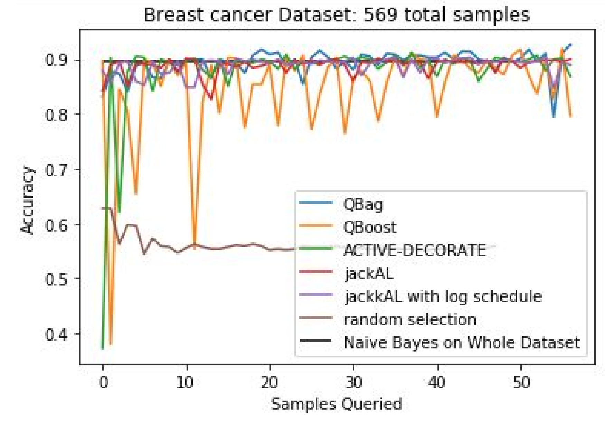

# qbc: a Python package for Query-by-Committee Active Learning
QBC Active Learning is a method used to increase sample efficency in situations where there is a low quantity of data. This implementation provides an automated pipeline to train a model ensemble using QBC active learning with arbitrary base learners.

Three methods from the literature (`QBag`, `QBoost`, `ACTIVE-DECORATE`), as well as one original approach (`jackAL`) based on the jackknife are implemented currently. Modifications and extensions to the articles are proposed and explained in the accompanying paper. 

# Abstract: 

The field of active learning has many different approaches. 
This work focuses on the Query-by-Committee (QbC) framework, which uses ensembling methods to find the best sample to query the oracle for a label. 
There are generally two parts to this approach. 
The first part is to construct and train a model ensemble. 
Two methods are implemented in this work: bagging and boosting. 
Bagging has the advantage of simplicity, but boosting often gives a larger performance increase. The second part is finding the most optimal example to query the oracle. This is done by finding the maximum “disagreement” of the classifiers, which is done via a
variety of methods, including entropy and KL divergence. Overall, the QbC method allows comparable or
greater accuracy to a classifier trained on the whole dataset, but with a vastly reduced number of required
samples. 
This work summarizes multiple approaches in the literature to QbC via bagging and boosting, and additionally proposes a new QbC framework called jackAL based on the jackknife; this method offers an advantage over the others because it allows the model to maximize small quantities of data, which is often the case when active learning is required. 
A variation on the jackknife, jackknife-$k$ is explored as well.
Additionally, all code is implemented in Python and made available as open-source software on GitHub.

# Author
[Benjamin Pierce](mailto:bgpierc@sandia.gov)

# License
MIT, see `LICENSE` for a copy of the license, or [avalible online](https://www.mit.edu/~amini/LICENSE.md)